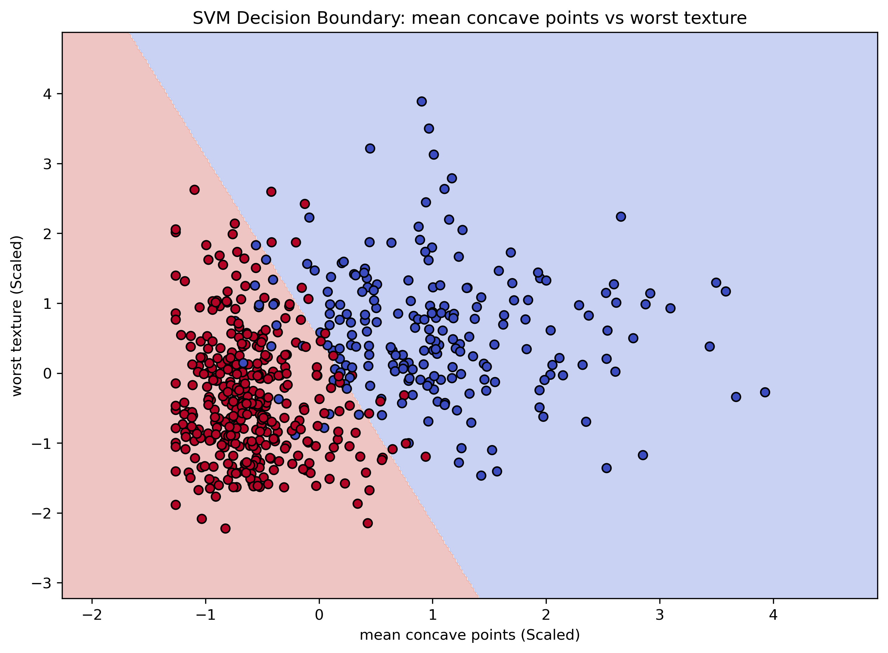

# Breast Cancer Diagnostic Classification 

## Project Overview
This project utilizes digitized images of fine needle aspirates (FNA) of breast masses to classify tumors as **Malignant** or **Benign**. I implemented a Support Vector Machine (SVM) to find the optimal decision boundary, prioritizing high **Recall** to minimize the risk of missed diagnoses.

##  Key Data Science Challenges
### 1. Multicollinearity & Feature Selection
The raw dataset contains 30 features. I identified that many (like Radius, Perimeter, and Area) were >90% correlated. To prevent model "confusion" and overfitting, I:
* Analyzed the Correlation Matrix.
* Programmatically dropped redundant features.
* Reduced the feature space while maintaining 99% of the predictive power.

### 2. SVM Hyperplane Optimization
I chose the **Support Vector Machine (SVM)** because it maximizes the "margin" between classes. In oncology, having a wide "buffer zone" between diagnoses adds a layer of statistical safety.

## Results & Visualizations
### The Decision Boundary

*Figure 1: Visualizing the SVM "Line in the Sand" between malignant and benign cells based on nuclei texture and concavity.*

### Performance Highlights
### Recall (Malignant): 98% — The model successfully identified almost all malignant cases, which is critical for patient safety.

Precision (Malignant): 96% — When the model predicted cancer, it was correct 96% of the time.

F1-Score: 0.97 — A near-perfect balance between catching all cases and maintaining accuracy.
* **High Sensitivity (Recall):** Successfully identified [98 %] of malignant cases.
* **Feature Scaling:** Applied `StandardScaler` to ensure the SVM distance calculations were not biased by feature units.

## Tech Stack
* **Modeling:** Scikit-Learn (SVC, train_test_split, StandardScaler)
* **Analysis:** Pandas, NumPy
* **Visualization:** Seaborn, Matplotlib

## Repository Contents
* `breast_cancer_analysis.ipynb`: The complete Python pipeline.
* `breast_cancer_cleaned.csv`: The dataset after redundancy removal.
* `cancer_decision_boundary.png`: High-resolution plot of the model's logic.

Multicollinearity" in simple terms
 If I ask two people the same question and they always give the exact same answer, I don't need both of them in the room. By removing 'Perimeter' and 'Area' and just keeping 'Radius,' I made the model faster and smarter by removing the echoes.

---
**Author:** Adedeji Bamidele 
**Objective:** Seeking roles in Healthcare Data Analysis and Predictive Modeling.

